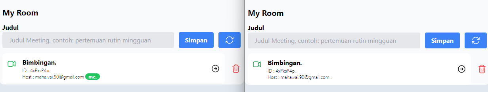
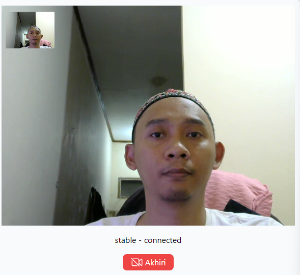
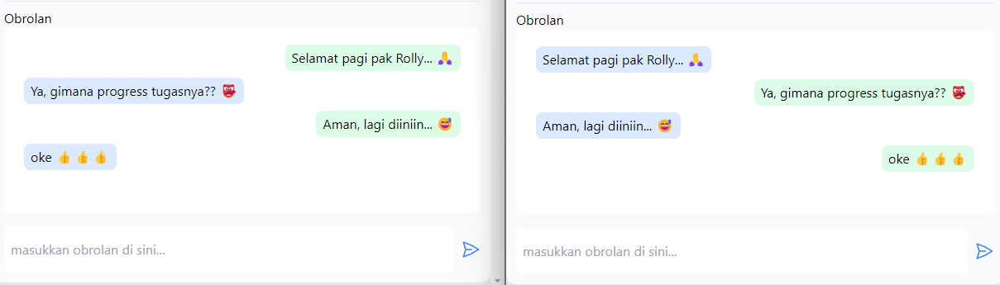

# room
Meeting Room

## Feature
1. Create Room  
  

2. P2P video call  
  

3. in app chat  
  

## Upcomming Feature
1. Recorde
2. Face Detection
3. Liveness Detection
4. Camera on/off
5. Microphone on/off
6. Share Screen

## Current Issuer
1. Can't reconnect if internet conneciton error
2. Failed to initiate video call when offer, answer and icedate not correct

## Upcomming Implementaiton
1. Use WS as signaling server